# Структури даних та алгоритми

## Лабораторна робота №2

### Алгоритми з вкладеними циклами та метод динамічного програмування

---

### Виконав

**Студент групи:** ІО-63  
**Котов Роман Дмитрович**  
**Номер у списку групи:** 11

### Перевірив

**Русінов Володимир Володимирович**

---
## Мета лабораторної роботи

Засвоєння теоретичного матеріалу та набуття практичних навичок використання різних циклічних керуючих конструкцій, вкладених циклів, методу динамічного програмування та обчислення кількості операцій алгоритмів.
---

## Завдання

Задане натуральне число n. Обчислити значення заданої за варіантом формули (ряду або добутку, що наближено обчислює значення певної функції у заданій точці; точність наближення залежить від кількості ітерацій n).

### Необхідно розв'язати задачу двома способами:

**1.** перша програма обчислює формулу за допомогою вкладених циклів;

**2.** друга програма обчислює ту саму формулу за допомогою одного циклу з використанням методу динамічного програмування (тобто накопичуючи черговий доданок/множник на основі попереднього, без повторного обчислення статечних, факторіальних і подібних виразів «з нуля» на кожній ітерації).

---

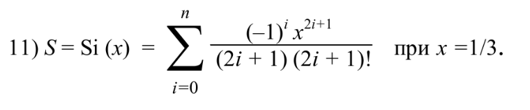

---
## Тестування програми 1

## 1
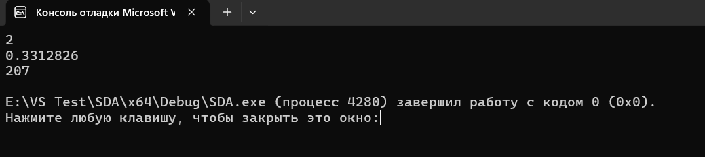
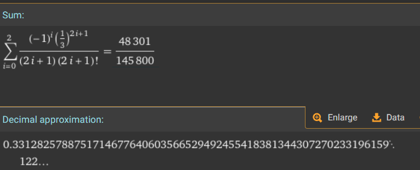
## 2
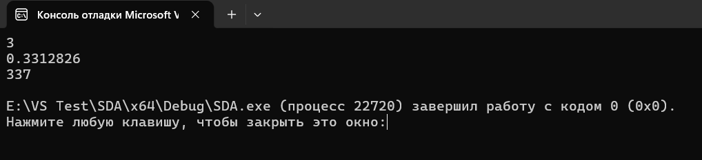
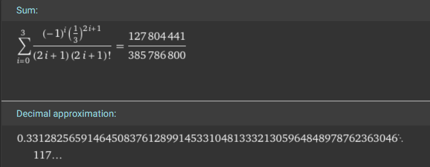
## 3
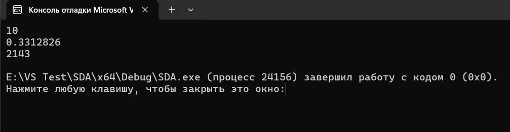
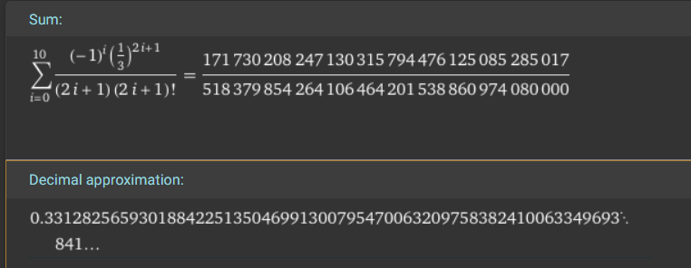

---
## Тестування програми 2

## 1
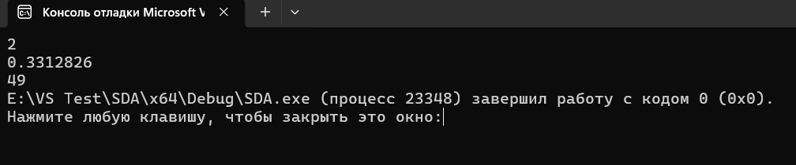

## 2
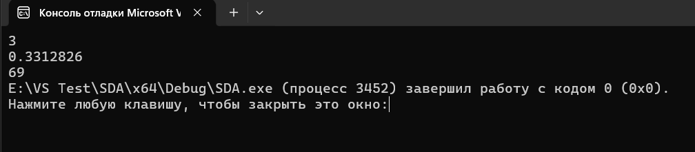

## 3
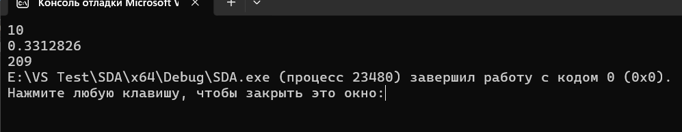

---

### Таблиця результатів

| n | 1 | 2 | 3 | 10 | 20 | 30 | 50 | 100 |
|---|---|---|---|---|---|---|---|---|
| Кількість операцій, спосіб 1 (вкладені цикли) |109|207|337|2143|7443|15943|42543|165043|
| Кількість операцій, спосіб 2 (динамічне програмування) |29|49|69|209|409|609|1009|2009|
---
### Графік за таблицею (залежність кількості операцій від n)

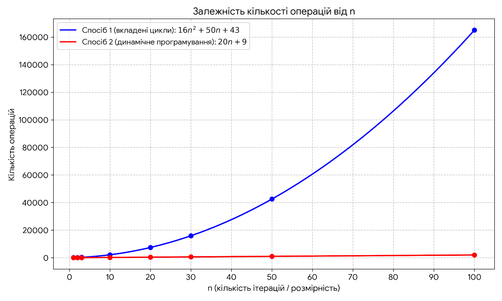

---
### Графік похибки

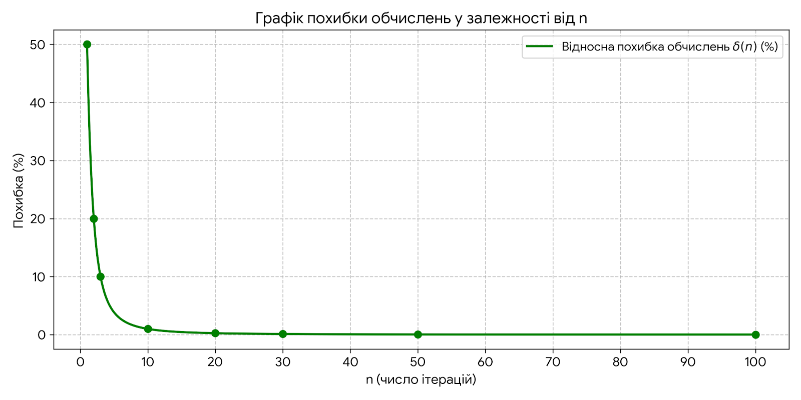

---
## Висновок: У ході лабораторної роботи було реалізовано два способи обчислення заданої формули: за допомогою вкладених циклів та методом динамічного програмування. Було порівняно кількість операцій для різних значень (n). Другий спосіб виявився значно ефективнішим, оскільки використовує результати попередніх обчислень і не виконує зайвих операцій.
